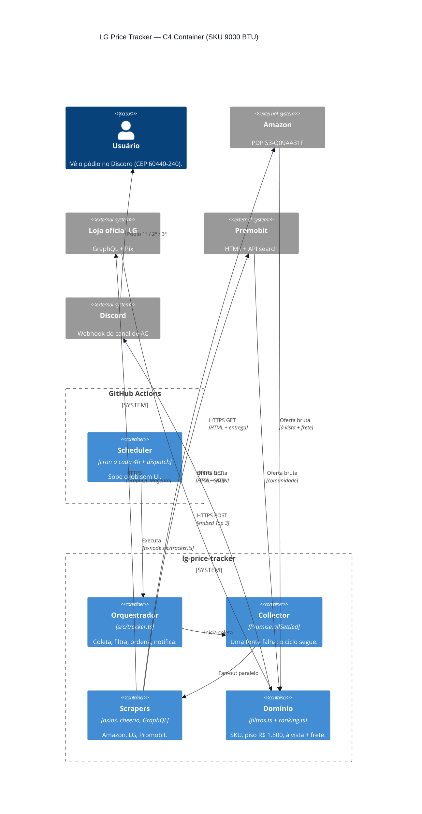

# Arquitetura — C4 Container

Rastreador de SKUs LG 9000 BTU. O usuário é o bonequinho C4 (`Person`) no topo.

```mermaid
%%{init: {"theme": "base", "themeVariables": {"darkMode": false, "background": "#ffffff", "primaryColor": "#dbeafe", "primaryTextColor": "#111827", "primaryBorderColor": "#1d4ed8", "lineColor": "#1f2937", "secondaryColor": "#fef3c7", "tertiaryColor": "#ffffff", "fontFamily": "Segoe UI, sans-serif"}}}%%
C4Container
title LG Price Tracker — C4 Container (SKU 9000 BTU)

Person(user, "Usuário", "Vê o pódio no Discord (CEP 60440-240).")

System_Boundary(gh, "GitHub Actions") {
    Container(cron, "Scheduler", "cron a cada 4h + dispatch", "Sobe o job sem UI.")
}

System_Boundary(app, "lg-price-tracker") {
    Container(orch, "Orquestrador", "src/tracker.ts", "Coleta, filtra, ordena, notifica.")
    Container(col, "Collector", "Promise.allSettled", "Uma fonte falha; o ciclo segue.")
    Container(sc, "Scrapers", "axios, cheerio, GraphQL", "Amazon, LG, Promobit.")
    Container(dom, "Domínio", "filtros.ts + ranking.ts", "SKU, piso R$ 1.500, à vista + frete.")
}

System_Ext(amazon, "Amazon", "PDP S3-Q09AA31F")
System_Ext(lg, "Loja oficial LG", "GraphQL + Pix")
System_Ext(promo, "Promobit", "HTML + API search")
System_Ext(discord, "Discord", "Webhook do canal de AC")

UpdateLayoutConfig($c4ShapeInRow="3", $c4BoundaryInRow="1")

Rel_D(cron, orch, "Executa", "ts-node src/tracker.ts")
Rel_D(orch, col, "Inicia coleta")
Rel_D(col, sc, "Fan-out paralelo")
Rel(sc, amazon, "HTTPS GET", "HTML + entrega")
Rel(sc, lg, "HTTPS", "GraphQL Magento")
Rel(sc, promo, "HTTPS GET", "HTML + JSON")
Rel(amazon, dom, "Oferta bruta", "à vista + frete")
Rel(lg, dom, "Oferta bruta", "Pix + SKU")
Rel(promo, dom, "Oferta bruta", "comunidade")
Rel(dom, discord, "HTTPS POST", "embed Top 3")
Rel(discord, user, "Pódio 1º / 2º / 3º")
```
