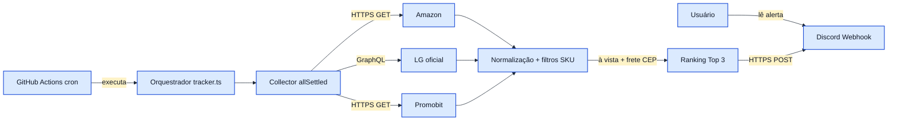

# Arquitetura — flowchart

Equivalente ao C4, para renderizadores que não suportam diagrama C4.

```mermaid
%%{init: {"theme": "base", "themeVariables": {"darkMode": false, "background": "#ffffff", "primaryColor": "#dbeafe", "primaryTextColor": "#111827", "primaryBorderColor": "#1d4ed8", "lineColor": "#1f2937", "secondaryColor": "#fef3c7", "tertiaryColor": "#ffffff", "clusterBkg": "#f8fafc", "clusterBorder": "#64748b", "fontFamily": "Segoe UI, sans-serif"}}}%%
flowchart LR
    classDef padrao fill:#dbeafe,stroke:#1d4ed8,color:#111827,stroke-width:1.5px
    U[Usuário] -->|lê alerta| D[Discord Webhook]
    G[GitHub Actions cron] -->|executa| O[Orquestrador tracker.ts]
    O --> C[Collector allSettled]
    C -->|HTTPS GET| A[Amazon]
    C -->|GraphQL| L[LG oficial]
    C -->|HTTPS GET| P[Promobit]
    A --> N[Normalização + filtros SKU]
    L --> N
    P --> N
    N -->|à vista + frete CEP| R[Ranking Top 3]
    R -->|HTTPS POST| D
    class U,D,G,O,C,A,L,P,N,R padrao
```
