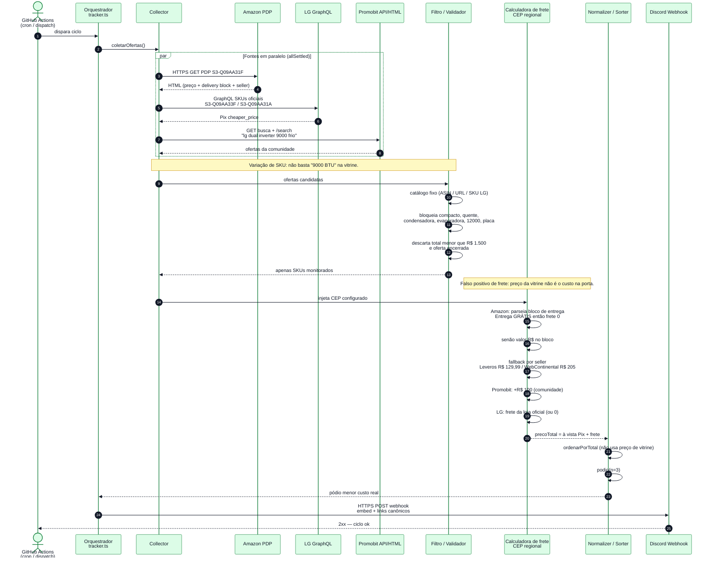

# Sequência — frete e variação de SKU

Ciclo automatizado: filtro de SKU, custo total com CEP regional configurado e pódio no Discord.

```mermaid
%%{init: {"theme": "base", "themeVariables": {"darkMode": false, "background": "#ffffff", "primaryColor": "#dbeafe", "primaryTextColor": "#111827", "primaryBorderColor": "#1d4ed8", "lineColor": "#1f2937", "secondaryColor": "#fef3c7", "tertiaryColor": "#ffffff", "noteBkgColor": "#fef9c3", "noteTextColor": "#111827", "noteBorderColor": "#ca8a04", "actorBkg": "#dcfce7", "actorBorder": "#15803d", "actorTextColor": "#111827", "signalColor": "#111827", "signalTextColor": "#111827", "labelBoxBkgColor": "#ffffff", "labelTextColor": "#111827", "loopTextColor": "#111827", "activationBkgColor": "#bfdbfe", "sequenceNumberColor": "#ffffff", "fontFamily": "Segoe UI, sans-serif"}}}%%
sequenceDiagram
    autonumber
    actor Cron as GitHub Actions<br/>(cron / dispatch)
    participant Orch as Orquestrador<br/>tracker.ts
    participant Col as Collector
    participant Amz as Amazon PDP
    participant LG as LG GraphQL
    participant Pb as Promobit API/HTML
    participant Filtro as Filtro / Validador
    participant Frete as Calculadora de frete<br/>CEP regional
    participant Rank as Normalizer / Sorter
    participant DC as Discord Webhook

    Cron->>Orch: dispara ciclo
    Orch->>Col: coletarOfertas()

    par Fontes em paralelo (allSettled)
        Col->>Amz: HTTPS GET PDP S3-Q09AA31F
        Amz-->>Col: HTML (preço + delivery block + seller)
        Col->>LG: GraphQL SKUs oficiais<br/>S3-Q09AA33F / S3-Q09AA31A
        LG-->>Col: Pix cheaper_price
        Col->>Pb: GET busca + /search<br/>"lg dual inverter 9000 frio"
        Pb-->>Col: ofertas da comunidade
    end

    Note over Col,Filtro: Variação de SKU: não basta "9000 BTU" na vitrine.
    Col->>Filtro: ofertas candidatas
    Filtro->>Filtro: catálogo fixo (ASIN / URL / SKU LG)
    Filtro->>Filtro: bloqueia compacto, quente,<br/>condensadora, evaporadora, 12000, placa
    Filtro->>Filtro: descarta total menor que R$ 1.500<br/>e oferta encerrada
    Filtro-->>Col: apenas SKUs monitorados

    Note over Frete: Falso positivo de frete: preço da vitrine não é o custo na porta.
    Col->>Frete: injeta CEP configurado
    Frete->>Frete: Amazon: parseia bloco de entrega<br/>Entrega GRÁTIS então frete 0
    Frete->>Frete: senão valor R$ no bloco
    Frete->>Frete: fallback por seller<br/>Leveros R$ 129,99 / WebContinental R$ 205
    Frete->>Frete: Promobit: +R$ 100 (comunidade)
    Frete->>Frete: LG: frete da loja oficial (ou 0)
    Frete-->>Rank: precoTotal = à vista Pix + frete

    Rank->>Rank: ordenarPorTotal (não usa preço de vitrine)
    Rank->>Rank: podio(n=3)
    Rank-->>Orch: pódio menor custo real

    Orch->>DC: HTTPS POST webhook<br/>embed + links canônicos
    DC-->>Cron: 2xx — ciclo ok
```
